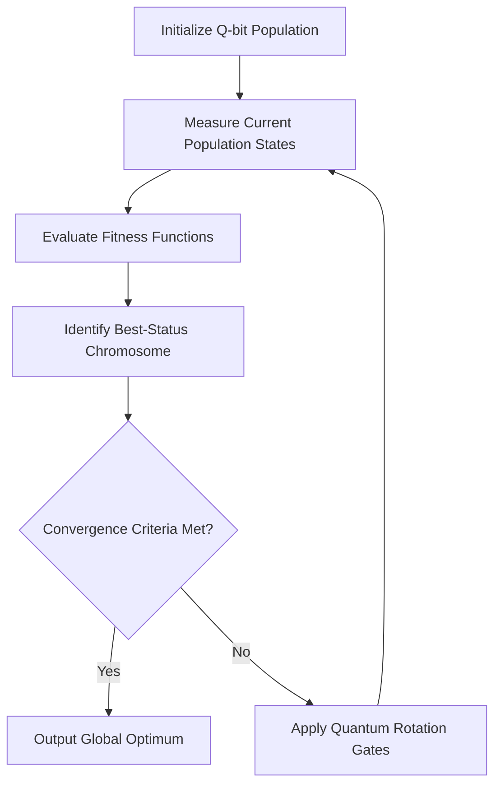

# Quantum-Genetic-Optimizer 🌌🧬

> **Core Focus:** Quantum-Inspired Evolutionary Computing, Combinatorial Optimization
> **Primary Language:** MATLAB
> **Key Concepts:** Quantum Bits (Q-bits), Superposition States, Quantum Rotation Gates, Heuristic Exploration

A high-performance implementation of a Quantum-Inspired Genetic Algorithm (QGA) designed to solve complex combinatorial optimization problems. By leveraging quantum computing concepts—such as representing chromosomes via Q-bit probabilities and driving population state-space exploration using quantum rotation gates—this optimizer achieves faster convergence and superior global search capabilities compared to classical genetic algorithms.

---

## 💡 The Architectural Concept

Classical Genetic Algorithms (GAs) represent solutions using binary or floating-point strings, which can easily suffer from premature convergence or trap the optimization loop in local minima. 

This implementation introduces **Quantum-Inspired Mechanics**:
* **Superposition Coding:** A single quantum chromosome can represent multiple states simultaneously through probability vectors, drastically increasing population diversity with a smaller overall population size.
* **Deterministic Exploration:** Instead of relying purely on random crossover and mutation mechanisms, state updates are driven by applying **Quantum Rotation Gates**, dynamically adjusting the search trajectory toward the best-known global solution.

---

## 🏗️ Algorithmic Workflow



---

## ⚡ Mathematical & Structural Framework

The core optimization loop utilizes quantum rotation gates ($\theta$) to update Q-bit registers based on target fitness criteria:

$$\begin{bmatrix} \alpha'_{i} \\ \beta'_{i} \end{bmatrix} = \begin{bmatrix} \cos(\theta_i) & -\sin(\theta_i) \\ \sin(\theta_i) & \cos(\theta_i) \end{bmatrix} \begin{bmatrix} \alpha_i \\ \beta_i \end{bmatrix}$$

### Performance Engineering Characteristics
* **High Diversity / Low Population Size:** Achieves optimal convergence profiles using a fraction of the population pool required by traditional heuristic models.
* **Parallel State Exploration:** Superposition modeling effectively parallelizes state search tracking prior to explicit measurement loops.
* **Dynamic Step-Size Tuning:** Mutation probabilities are scaled adaptively based on fitness history curves to balance exploration and exploitation.

---

## 📂 Repository Layout

```text
Quantum-Genetic-Optimizer/
├── src/
│   ├── initialize_qbits.m   # Q-bit register population initialization
│   ├── quantum_gate_update.m # Quantum rotation gate step functions
│   └── fitness_evaluator.m  # Domain-specific objective functions
├── examples/
│   └── knapsack_problem_qga.m # Sample combinatorial benchmark implementation
├── benchmarks/
│   └── convergence_profile.m # Scripts comparing classical GA vs. QGA convergence curves
└── README.md
